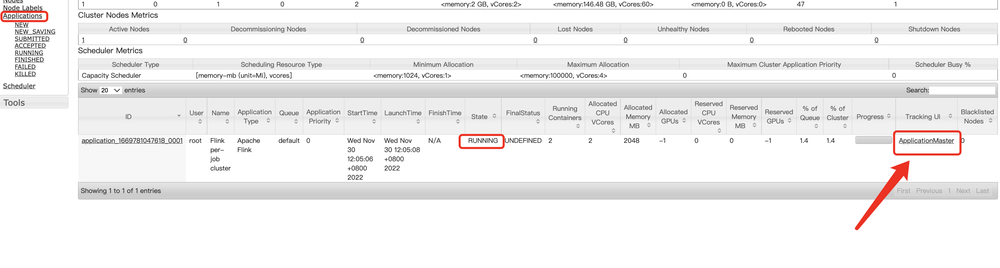
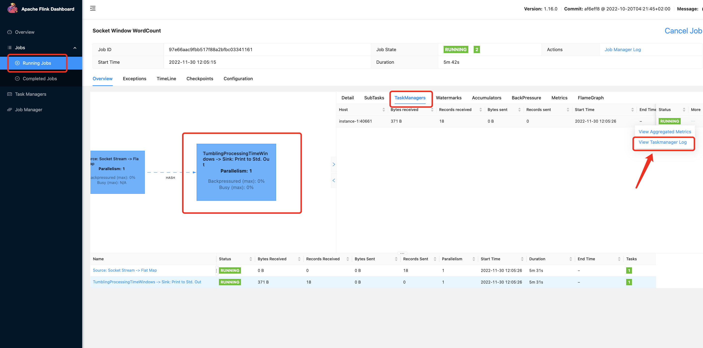
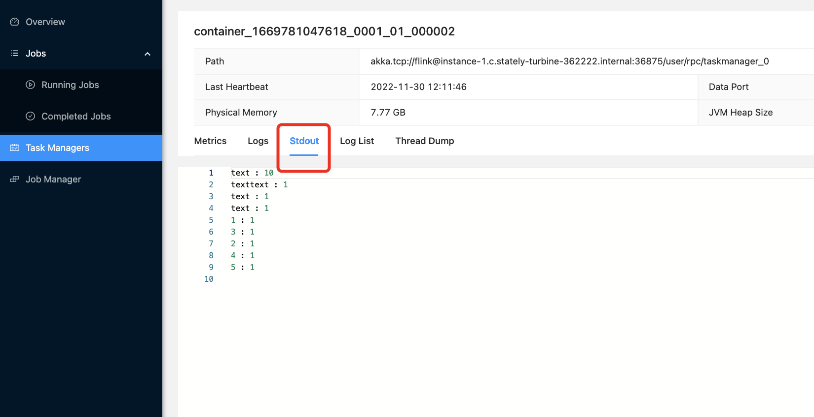
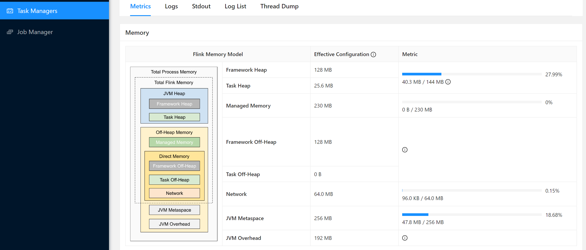

## Install Flink and Kafka on a 3-node Hadoop cluster

- Make sure your manager node can `ssh` to the other 2 worker nodes

### Switch to root and Download the source code

- `su root`
- `cd ~`
- `git clone https://github.com/yingmao/kafka-flink.git`

### Install the programming environment

- `cd /root/kafka-flink/`
- `bash pre_install.bash manager-internal-ip,worker-1-internal-ip,worker-2-internal-ip`

### Install Kafka

- `bash install_kafka_cluster.bash manager-internal-ip,worker-1-internal-ip,worker-2-internal-ip`

### Install Flink on Hadoop

- `bash install_flink_on_hadoop_cluster.bash manager-internal-ip,worker-1-internal-ip,worker-2-internal-ip`

### Run Kafka example

- `open two terminals`
- `Go to Kafka-demo folder on terminals`
- Ternimal-1 `python3 producer.py manager_internal_ip:9092`
- Terminal-2 `python3 consumer.py manager_internal_ip:9092`

### Run Flink on Hadoop example

- `open two terminals`
- `Go to Flink-demos folder on terminals`
- Terminal-1 `bash socket.bash 9002`  
- Terminal-2 `bash run.bash 9002`
- You can input any words on Terminal-1

### Check Flink on Hadoop Web-UI

- Open your local browser
- Input url: http://Your-manager-external-ip:7438/cluster   
- Replace `Your-manager-external-ip` with the real IP.
- You will enter Hadoop Web-UI
- Click `ApplicationMaster` link, see image-1.
- You will see a 404 page
- Replace the url with `Your-manager-external-ip`. For example, this is my url http://instance-1.c.stately-turbine-362222.internal:7438/proxy/application_1669781047618_0001/. This is the replaced url, http://34.127.105.242:7438/proxy/application_1669781047618_0001/. The IP 34.127.105.242 is my manager's external IP.
- Now you will see the Flink Web-UI and you can check the results there. See image-2, image-3, and image-4

### Restart the Flink and Kafka service

- When you stopped your instances and started them again, you will need to restart Flink/Kafka before executing any applications.
- To restart the services, please run `restart_flink.bash` or `restart_kafka.bash`

### Web-UI

- If the Flink terminal is running without any errors but you cannot find the Web-UI, it should be the setting of Google cloud firewall.
- Please follow the instructions to create a firewall rule and open the port numbers.
- https://cloud.google.com/vpc/docs/using-firewalls

